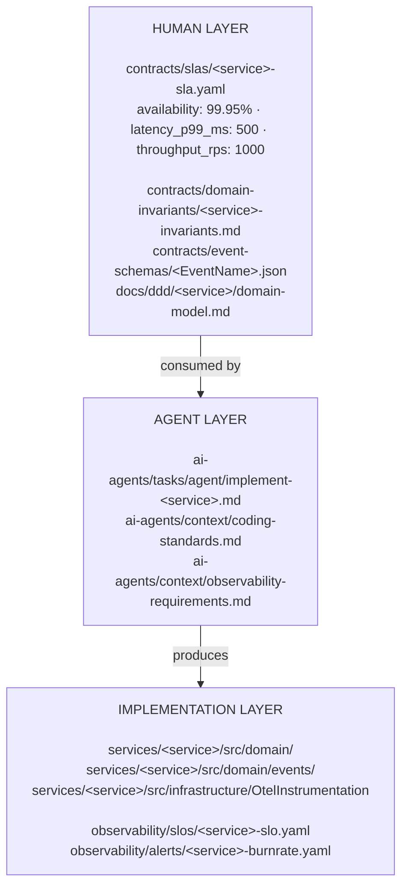

# Contracts

## What Humans Author

Contracts are the human-authored source of truth. They are the only inputs agents are permitted to trust. Every contract artifact must be:

- **Versioned** in source control alongside the code it governs
- **Owned** by a human (or a human-approved review gate) — no agent may modify a contract
- **Complete before implementation begins** — an agent that starts before a contract exists will hallucinate domain behaviour

| Contract type | Why a human, not an agent |
|---|---|
| SLA targets | Business commitment to users; requires stakeholder negotiation |
| Domain invariants | Business rules that encode years of operational learning |
| Event schemas | The shared language between teams; breaking changes have production consequences |
| Architecture Decision Records | Tradeoff reasoning requires context, history, and judgment |
| Bounded context maps | Organisational and domain boundaries are political as much as technical |
| Migration phase docs | Risk sequencing requires knowledge of operational constraints and team capacity |
| Agent task specs | The spec is itself the human judgment artifact — it defines what "correct" means |

## What AI Agents Build

Agents consume contracts to produce implementation artifacts. Every agent output is traceable to one or more contracts that authorised it.

| Artifact type | Consumed contracts |
|---|---|
| Service domain logic | Domain invariants, domain models |
| Typed event classes | Event schemas |
| Command handlers | Domain models + API contracts |
| OTEL instrumentation | SLA targets + observability requirements |
| Infrastructure manifests | Service manifest + ADRs + infra conventions |
| CI/CD pipelines | Service manifest + coding standards |
| Observability alerts | SLO definitions (derived from SLA targets) |
| Automation scripts | Script task specs |

## The Contract → Implementation Flow

