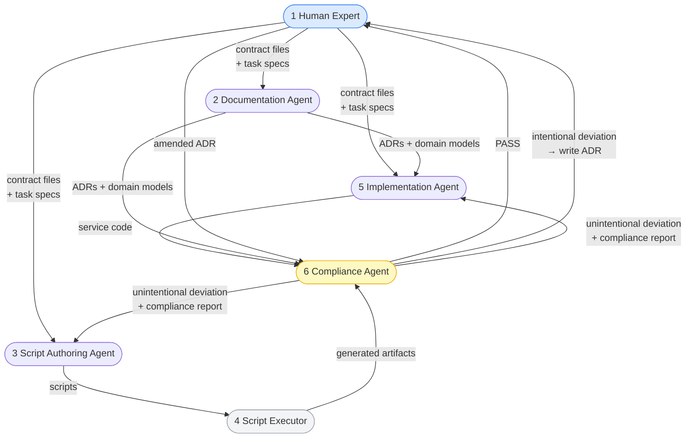

# Personas

This document defines the six personas that participate in the development workflow. Every artifact in this repository was produced by one of these personas. The line between them is explicit and enforced.

---

## Overview

| # | Persona | Type | Primary output |
|---|---|---|---|
| 1 | [Human Domain Expert](persona-1-human-domain-expert.md) | Human | Contracts, ADR stubs, task specs |
| 2 | [Documentation Agent](persona-2-documentation-agent.md) | LLM | ADRs, domain models, migration docs, runbooks |
| 3 | [Script Authoring Agent](persona-3-script-authoring-agent.md) | LLM (one-shot) | Deterministic scripts in `tooling/` |
| 4 | [Script Executor](persona-4-script-executor.md) | Automation | Generated artifacts (alerts, Helm, CI, validation reports) |
| 5 | [Implementation Agent](persona-5-implementation-agent.md) | LLM | Service source code and tests |
| 6 | [Compliance Agent](persona-6-compliance-agent.md) | LLM (auditor) | Compliance reports in `ai-agents/reviews/` |

---

## Persona Interaction Map

