# Workflow

The workflow is a **closed cycle**. Business intent enters at **Intake/Triage**, is classified and routed to the right phase entry point, executes through the relevant phases, reaches the running system, and generates signals that re-enter as the next business intent.

Phases 0–6 must run in order — each phase's outputs are required inputs for the next. Phase 7 and 7b are the **feedback arc**: they detect change signals from the running system and produce the next Intake input, closing the loop.

Full Intake/Triage documentation: [Intake/Triage](../intake/index.md)

---

```mermaid
flowchart TD
    INTAKE["INTAKE / TRIAGE — all business intent enters here<br/><br/>Input: user story · feature brief · incident report · market signal<br/><br/>Round 1: [6] Compliance Agent + [5] Implementation Agent<br/>Challenge: ADR conflicts · bounded context · edge cases · state ownership<br/><br/>Round 2: [2] Documentation Agent + [3] Script Authoring Agent<br/>Challenge: ubiquitous language · ADR scope · scriptability<br/><br/>Output: Intake Report · Draft Contracts · Triage Decision<br/><br/>See: docs/intake/index.md"]

    P0["Phase 0 — Bootstrap<br/><br/>[1] Human Expert: contracts/slas · domain-invariants · event-schemas<br/>tooling/service-manifest.yaml · ai-agents/tasks/ specs<br/>[3] Script Authoring: validate-contracts.sh<br/>[4] Script Executor: baseline validation pass"]

    P1["Phase 1 — Architecture Foundation<br/><br/>[1] Human Expert: ADR stubs · bounded-contexts.md · ubiquitous-language.md<br/>[2] Documentation Agent: full ADRs · domain-model.md · state-machine.md<br/>← Human Review: ADRs correct? Domain models match invariants?"]

    P2["Phase 2 — Contract → Observability<br/><br/>[3] Script Authoring: generate-artifact.py<br/>[4] Script Executor: slos/*.yaml · alerts/*-burnrate.yaml<br/>validate-contracts.sh → SLA↔SLO↔alert chain verified<br/>← Human Review: thresholds reflect SLA intent?"]

    P3["Phase 3 — Contract → API Contracts<br/><br/>[2] Documentation Agent: api/openapi/*.yaml · api/asyncapi/*.yaml<br/>← Human Review: API matches domain model? Breaking-change rules clear?"]

    P4["Phase 4 — Contract → Infrastructure<br/><br/>[3] Script Authoring: generate-helm-boilerplate.sh · generate-ci-workflow.sh<br/>[4] Script Executor: Helm charts · CI workflows · CODEOWNERS<br/>[6] Compliance Agent reviews generated infra<br/>Output: ai-agents/reviews/infra-compliance-service-date.md"]

    P4C{Compliance?}

    P4ADR["[1] Human Expert writes/amends ADR<br/>[6] Compliance Agent: second pass scoped to deviation"]

    P4FIX["[3+4] Re-run scripts with compliance report as context"]

    P5["Phase 5 — Contract → Service Implementation<br/><br/>[5] Implementation Agent: domain · application · infrastructure layers<br/>Reads: contracts/ · docs/ddd/ · api/openapi/ · ai-agents/context/<br/>[4] validate-contracts.sh → event classes match schemas<br/>[6] Compliance Agent reviews implementation<br/>Output: ai-agents/reviews/impl-compliance-service-date.md<br/>← Human Review: invariants enforced? OTEL names/buckets correct?"]

    P5C{Compliance?}

    P5ADR["[1] Human Expert writes/amends ADR<br/>[6] Compliance Agent: second pass scoped to deviation"]

    P5FIX["[5] Implementation Agent re-runs with compliance report"]

    P6["Phase 6 — Migration + Operations Documentation<br/><br/>[2] Documentation Agent: docs/migration/ · docs/runbooks/<br/>← Human Review: rollback gates tied to alerts? Runbooks reference correct alert names?"]

    P7["Phase 7 — Continuous: Contract Change<br/><br/>SLA changed → [4] re-generate alerts · [6] compliance check<br/>Invariant changed → [5] re-implement · [4] validate · [6] check<br/>Schema additive → [5] update event class · [2] update asyncapi<br/>Schema breaking → [1] ADR first · then additive path"]

    P7B["Phase 7b — Continuous: New Bounded Context<br/><br/>Step 1: [1] Context boundary decision + ADR stub<br/>         [6] Coupling review · shared-DB check · integration pattern<br/>Steps 2–7: Contracts → Architecture → Observability → API<br/>            → Infrastructure → Implementation → Migration doc"]

    FEEDBACK["FEEDBACK ARC — signals re-enter as new business intent<br/><br/>SLA breach alert → Intake Round 1<br/>Contract change detected → Phase 0 direct<br/>New bounded context → full intake dialogue<br/>Compliance review failure → Intake Round 1"]

    INTAKE -->|New feature / service| P0
    INTAKE -.->|Observability gap| P2
    INTAKE -.->|Infra / CI change| P4
    INTAKE -.->|Implementation patch| P5

    P0 --> P1 --> P2 --> P3 --> P4

    P4 --> P4C
    P4C -->|PASS| P5
    P4C -->|Intentional deviation| P4ADR
    P4ADR -->|re-check| P4C
    P4C -->|Unintentional deviation| P4FIX
    P4FIX -->|re-check| P4C

    P5 --> P5C
    P5C -->|PASS| P6
    P5C -->|Intentional deviation| P5ADR
    P5ADR -->|re-check| P5C
    P5C -->|Unintentional deviation| P5FIX
    P5FIX -->|re-check| P5C

    P6 --> P7 --> P7B --> FEEDBACK
    FEEDBACK -->|re-enters as next intent| INTAKE
```

